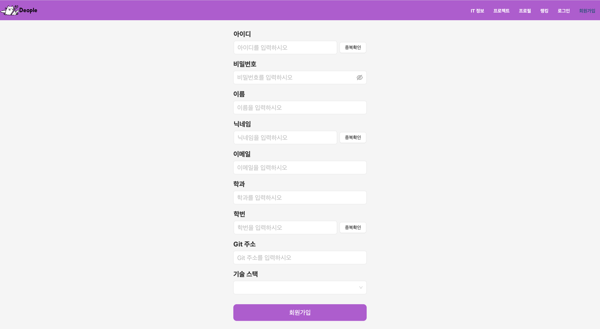
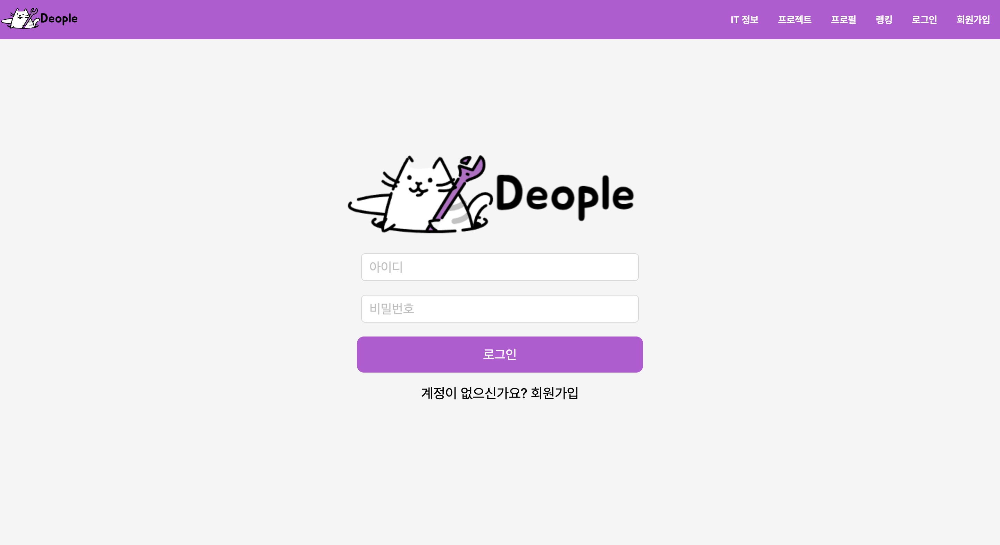
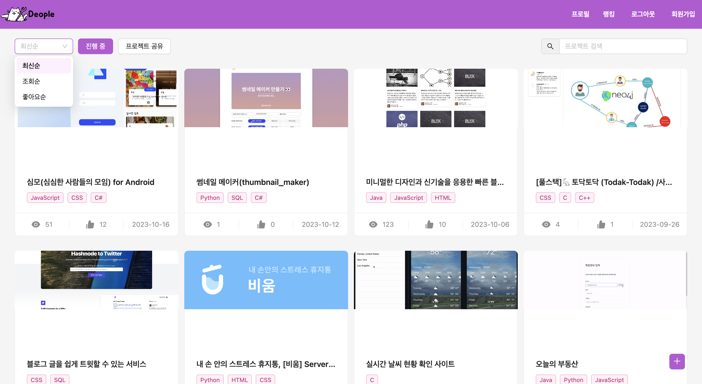
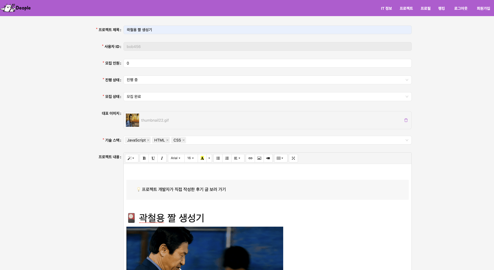
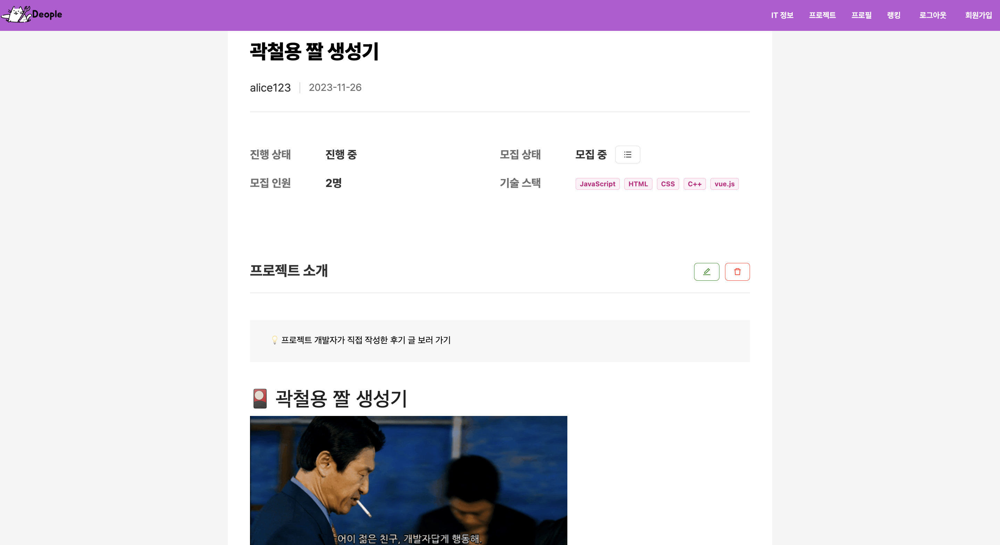
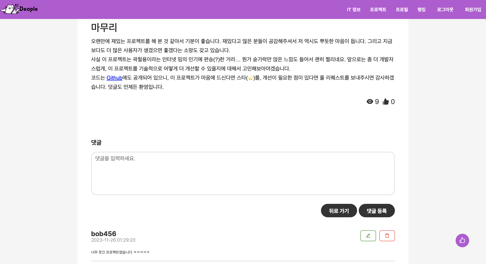
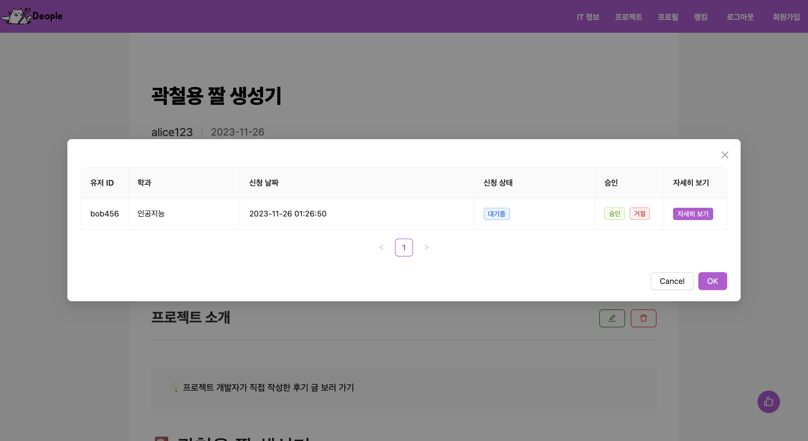
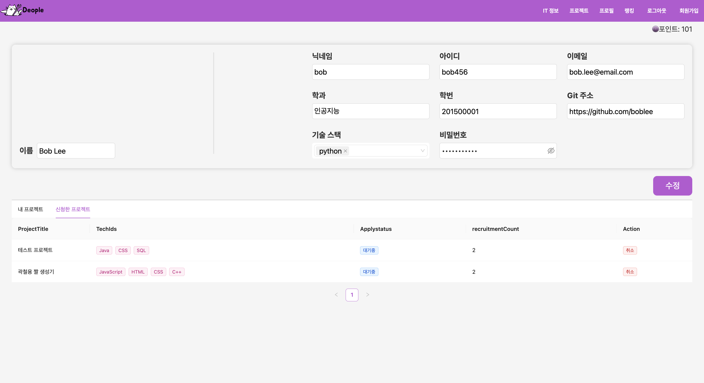
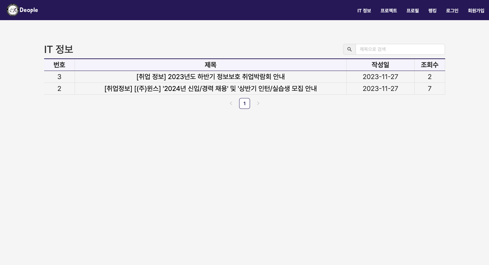
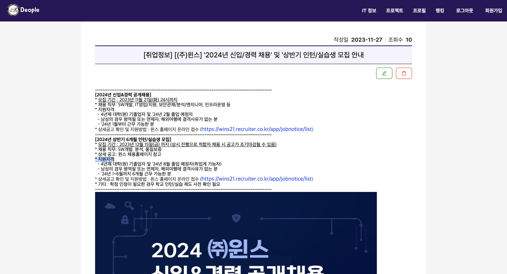

<h1>Deople</h1>
캡스톤 디자인 수업에서 진행한 팀 프로젝트입니다.
 
로컬 환경이기 때문에 백엔드도 같이 실행하여야 합니다.
 
<a href='https://github.com/Jung-sunghoon/capstone_backend'>https://github.com/Jung-sunghoon/capstone_backend</a>
<h2>1. 구동 환경 설치</h2>
<pre>
  <code>
  npm create vite@latest my-vue-app -- --template react-ts
  cd (폴더 명)
   
  // npm 사용 시
  npm install
  npm run dev
   
  // yarn 사용 시
  yarn add
  yarn dev
  </code>
</pre>

<h2>2. 기능 상세</h2>
<ol>
  <li>회원가입 페이지</li>
  
  
아이디, 비밀번호, 이름, 닉네임, 이메일, 학과, 학번, Github 주소, 기술 스택을 입력하여 회원가입합니다. 회원가입 시 중복 확인 버튼을 눌러 아이디, 닉네임, 학번이 전부 중복되지 않을 경우 회원가입이 완료됩니다.

   
  <li>로그인 페이지</li>
  
  
회원가입 시 입력한 아이디와 비밀번호를 입력합니다. 로그인 시 아이디가 로컬스토리지에 저장됩니다. 이는 프로젝트 생성, 수정, 삭제, 프로젝트 신청 등에 사용됩니다.

   
  <li>프로젝트 리스트 페이지</li>
  
  
프로젝트 리스트 페이지입니다. 진행 중과 프로젝트 공유(완료)로 나뉘어지며 최신순, 조회순, 좋아요순으로 정렬할 수 있습니다. 또한 검색 컴포넌트를 통해 제목으로 프로젝트 검색이 가능합니다.

   
  <li>프로젝트 생성 페이지</li>
  
  
프로젝트 생성 페이지입니다. 제목, 모집 인원, 프로젝트 진행 상태, 모집 상태(여부), 대표 이미지(썸네일), 기술 스택, 프로젝트 내용을 생성 생성됩니다.

   
  <li>프로젝트 디테일 페이지</li>
  
  
프로젝트 디테일 페이지입니다. 로컬스토리지에 저장된 아이디와 프로젝트 생성자가 동일할 경우 모집 상태에 있는 목록 버튼을 클릭하여 신청 목록을 볼 수 있고, 다를 경우 모집 상태에 따라 프로젝트에 신청할 수 있습니다.

   
  <li>프로젝트 디테일 페이지 댓글 기능</li>
  
  
댓글 기능입니다. 댓글 창을 통해 댓글을 달아 피드백할 수 있도록 하였습니다. 댓글도 로컬스토리지의 아이디와 비교하여 동일할 경우 수정 및 삭제가 가능합니다.

   
  <li>프로젝트 신청 기능</li>
  
  
프로젝트가 모집 진행 중에 있다면 신청 버튼을 통해 신청 할 수 있습니다. 현재 보이는 화면은 프로젝트 신청자를 볼 수 있는 목록이며 승인 혹은 거절을 통해 팀원을 모집할 수 있습니다. 자세히 보기를 누르면 해당 인원의 프로필이 Modal로 띄워집니다.

   
  <li>프로필 페이지</li>
  
  
프로필 페이지입니다. 회원가입 시 입력한 정보들이 띄워집니다. 로컬 스토리지의 아이디와 동일할 경우 input을 통해 볼 수 있고, 다르다면 비밀번호는 보이지 않게 되며 다른 정보들도 수정 할 수 없습니다. 또한 내가 생성한 프로젝트 혹은 내가 신청한 프로젝트 들을 볼 수 있습니다.

   
  <li>랭킹 페이지</li>
  
  
랭킹 페이지 입니다. 활동에 따른 포인트가 주어집니다. 포인트에 따라 랭킹이 부여되며 이는 성실성의 척도로 보여질 수 있습니다.

   
  <li>IT 정보 페이지</li>
  
  
IT 정보 페이지입니다. 관리자 계정을 사용해 관리자만 게시물 생성, 수정, 삭제가 가능하며 취업 정보나 공모전 정보 등을 올려주는 페이지입니다.

   
  <li>IT 정보 디테일 페이지</li>
  
  
IT 정보 디테일 페이지입니다. 관리자가 생성한 IT 정보 게시물의 내용을 볼 수 있습니다.

</ol>
